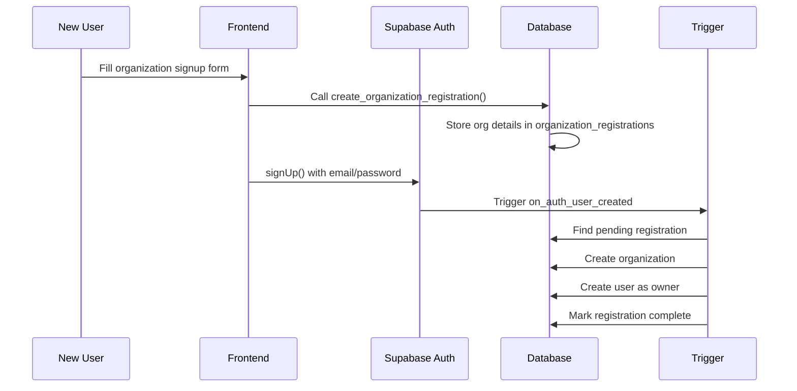
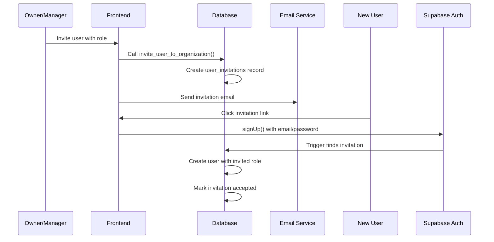

# Authentication Bridge System Guide

## Overview

The authentication bridge system seamlessly connects Supabase's built-in authentication with our custom multi-tenant CRM database. This system handles two primary flows:

1. **New Organization Registration**: Contractors can sign up and automatically create their organization
2. **User Invitations**: Existing organizations can invite team members with specific roles

## Database Architecture

### Core Tables

#### `user_invitations`
Manages pending user invitations to organizations
- **Purpose**: Track and validate user invitations before account creation
- **Key Features**: 
  - 7-day expiration by default
  - Unique constraint prevents duplicate invitations
  - Links to organization and inviting user

#### `organization_registrations`
Temporary table for organization signup process
- **Purpose**: Store organization details during Supabase auth signup
- **Lifecycle**: Created during signup form → Consumed by trigger → Marked completed
- **Security**: Only accessible by the auth user who created it

#### Enhanced `users` table
Bridges `auth.users` with organization structure
- **Key Relationship**: `users.id` = `auth.users.id` (UUID)
- **Organization Link**: Every user belongs to exactly one organization
- **Role Management**: Enforces role-based permissions

## Authentication Flows

### 1. New Organization Registration



**Implementation Steps:**

1. **Frontend Form Submission**:
```typescript
// Before Supabase auth signup
const registrationId = await supabase.rpc('create_organization_registration', {
  p_auth_user_id: tempUserId, // Generate temp UUID
  p_organization_name: 'Exterior Finishes LLC',
  p_organization_slug: 'exterior-finishes',
  p_owner_first_name: 'John',
  p_owner_last_name: 'Smith',
  p_owner_email: 'john@exteriorfinishes.com',
  p_phone: '555-123-4567',
  p_address_line_1: '123 Main St',
  p_city: 'Springfield',
  p_state: 'IL',
  p_zip_code: '62701'
});
```

2. **Supabase Auth Signup**:
```typescript
const { data, error } = await supabase.auth.signUp({
  email: 'john@exteriorfinishes.com',
  password: 'securePassword',
  options: {
    data: {
      first_name: 'John',
      last_name: 'Smith',
      registration_id: registrationId
    }
  }
});
```

3. **Automatic Processing**: 
- Database trigger `handle_new_user()` executes
- Creates organization with 'trial' status
- Creates user record with 'owner' role
- Sets up proper multi-tenant relationships

### 2. Team Member Invitation



**Implementation Steps:**

1. **Send Invitation**:
```typescript
const invitationId = await supabase.rpc('invite_user_to_organization', {
  p_organization_id: currentUser.organization_id,
  p_email: 'estimator@exteriorfinishes.com',
  p_role: 'estimator',
  p_invited_by: currentUser.id
});

// Send email with invitation link
// Link format: /signup?invitation_token=uuid&email=encoded_email
```

2. **Accept Invitation**:
```typescript
// User clicks link and signs up
const { data, error } = await supabase.auth.signUp({
  email: invitationEmail,
  password: userPassword,
  options: {
    data: {
      first_name: 'Jane',
      last_name: 'Doe',
      invitation_token: tokenFromUrl
    }
  }
});
```

3. **Automatic Processing**:
- Trigger finds valid invitation by email
- Creates user with invited role
- Links to existing organization
- Marks invitation as accepted

## Database Functions Reference

### Core Functions

#### `create_organization_registration()`
```sql
create_organization_registration(
    p_auth_user_id UUID,
    p_organization_name VARCHAR(255),
    p_organization_slug VARCHAR(100),
    p_owner_first_name VARCHAR(100),
    p_owner_last_name VARCHAR(100),
    p_owner_email VARCHAR(255),
    p_phone VARCHAR(20) DEFAULT NULL,
    p_address_line_1 TEXT DEFAULT NULL,
    p_city VARCHAR(100) DEFAULT NULL,
    p_state VARCHAR(50) DEFAULT NULL,
    p_zip_code VARCHAR(20) DEFAULT NULL
) RETURNS UUID
```

**Purpose**: Creates pending organization registration
**Returns**: Registration ID for tracking
**Validates**: Organization slug uniqueness

#### `invite_user_to_organization()`
```sql
invite_user_to_organization(
    p_organization_id UUID,
    p_email VARCHAR(255),
    p_role user_role,
    p_invited_by UUID
) RETURNS UUID
```

**Purpose**: Creates user invitation with expiration
**Returns**: Invitation ID
**Validates**: 
- Inviter belongs to organization
- Email not already in use
- No duplicate pending invitations

#### `get_user_org_info()`
```sql
get_user_org_info(p_user_id UUID)
RETURNS TABLE(
    user_id UUID,
    organization_id UUID,
    organization_name VARCHAR(255),
    organization_slug VARCHAR(100),
    user_role user_role,
    user_status user_status,
    is_admin BOOLEAN
)
```

**Purpose**: Get complete user session information
**Use Case**: Frontend authentication state management

### Utility Functions

#### `cleanup_expired_invitations()`
```sql
cleanup_expired_invitations() RETURNS INTEGER
```

**Purpose**: Remove expired invitations (run via cron)
**Returns**: Count of deleted invitations
**Schedule**: Recommended daily execution

#### `get_organization_stats()`
```sql
get_organization_stats(p_organization_id UUID)
RETURNS TABLE(
    total_users INTEGER,
    active_users INTEGER,
    pending_invitations INTEGER,
    total_leads INTEGER,
    total_jobs INTEGER,
    total_estimates INTEGER
)
```

**Purpose**: Dashboard statistics for organizations
**Use Case**: Admin dashboard overview

## Security Features

### Row Level Security (RLS)

All tables implement comprehensive RLS policies:

1. **Multi-tenant Isolation**: Users can only access their organization's data
2. **Role-based Permissions**: Different roles have different access levels
3. **Invitation Security**: Only organization admins can manage invitations

### Data Integrity

#### Organization Ownership Validation
```sql
-- Ensures every organization has at least one active owner
ALTER TABLE organizations ADD CONSTRAINT check_organization_has_owner
    CHECK (EXISTS (
        SELECT 1 FROM users 
        WHERE users.organization_id = organizations.id 
        AND users.role = 'owner' 
        AND users.status = 'active'
    ));
```

#### Automatic Audit Trails
- User login statistics automatically updated
- All CRM tables have updated_at timestamps
- User sessions tracked for security monitoring

## Role Permissions Matrix

| Role | Organizations | Users | Contacts | Leads | Estimates | Jobs | Communications |
|------|---------------|-------|----------|--------|-----------|------|-------------|
| **Owner** | Full | Full | Full | Full | Full | Full | Full |
| **Operations Manager** | Read/Update | Full | Full | Full | Full | Full | Full |
| **Sales Manager** | - | - | Full | Full | Read/Update | Read | Full |
| **Estimating Manager** | - | - | Read | Read/Update | Full | Read | Full |
| **Estimator** | - | - | Read | Read | Create/Read/Update | - | Create/Read |
| **Field Management** | - | - | Read | - | - | Read/Update | Full |

## Frontend Integration Examples

### User Session Management

```typescript
// Get current user info with organization
const getCurrentUserInfo = async () => {
  const { data: { user } } = await supabase.auth.getUser();
  if (!user) return null;

  const { data } = await supabase.rpc('get_user_org_info', {
    p_user_id: user.id
  });

  return data[0]; // Returns user + organization info
};
```

### Check User Permissions

```typescript
const hasPermission = (userRole: string, resource: string, action: string) => {
  // Implement based on role_permissions table
  // Owner has full access
  if (userRole === 'owner') return true;
  
  // Check specific permissions for other roles
  // This would query role_permissions table
};
```

### Organization Stats Dashboard

```typescript
const getOrgStats = async (organizationId: string) => {
  const { data } = await supabase.rpc('get_organization_stats', {
    p_organization_id: organizationId
  });
  
  return data[0];
};
```

## Migration Deployment

1. **Deploy Migration**:
```bash
cd database
node deploy.js
```

2. **Verify Tables Created**:
```sql
-- Check new tables exist
SELECT table_name FROM information_schema.tables 
WHERE table_schema = 'public' 
AND table_name IN ('user_invitations', 'organization_registrations');

-- Check triggers exist
SELECT trigger_name FROM information_schema.triggers
WHERE event_object_table = 'users' 
AND trigger_name = 'on_auth_user_created';
```

3. **Test Functions**:
```sql
-- Test organization registration
SELECT create_organization_registration(
  'test-uuid'::uuid,
  'Test Organization',
  'test-org',
  'Test',
  'User',
  'test@example.com'
);
```

## Troubleshooting

### Common Issues

1. **Trigger Not Firing**: Ensure trigger exists on `auth.users` table
2. **RLS Blocking Access**: Check user has proper organization_id set
3. **Invitation Expired**: Clean up expired invitations regularly
4. **Duplicate Slug**: Handle organization slug conflicts in frontend

### Debug Queries

```sql
-- Check pending registrations
SELECT * FROM organization_registrations WHERE is_completed = false;

-- Check pending invitations
SELECT * FROM user_invitations WHERE accepted_at IS NULL AND expires_at > NOW();

-- Verify user-organization relationships
SELECT u.email, u.role, o.name as org_name 
FROM users u 
JOIN organizations o ON u.organization_id = o.id;
```

This authentication bridge system provides a robust foundation for your multi-tenant CRM, handling all the complexity of user registration, organization creation, and team member invitations while maintaining strict security boundaries between organizations.